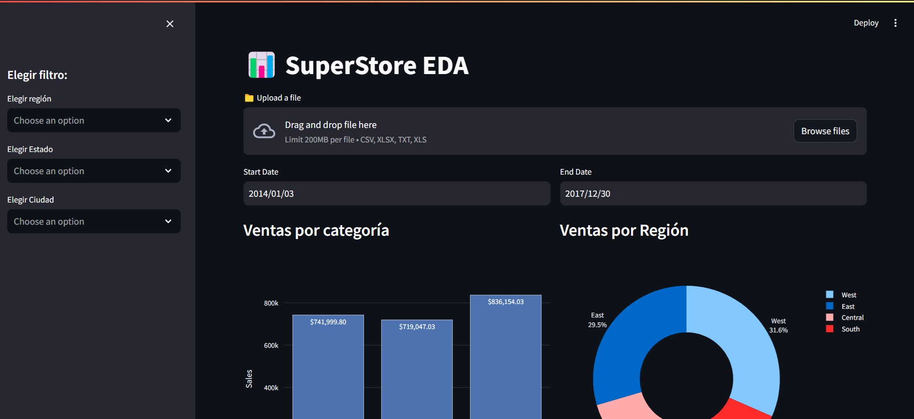
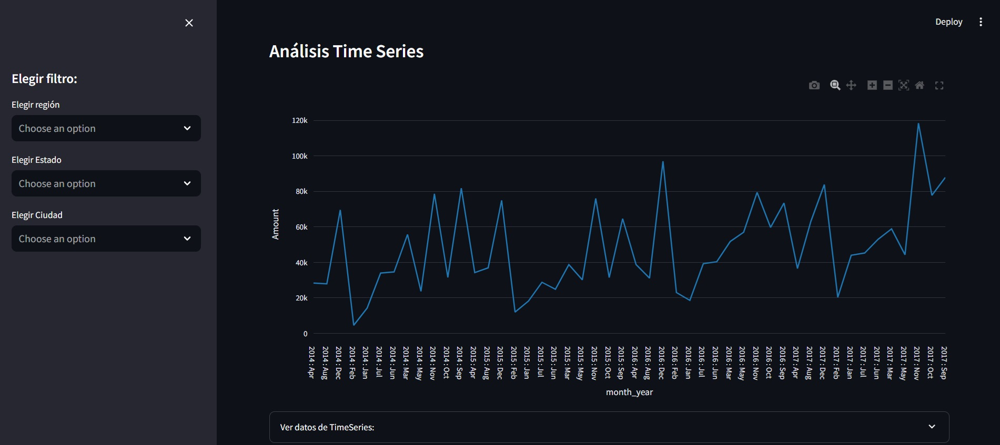
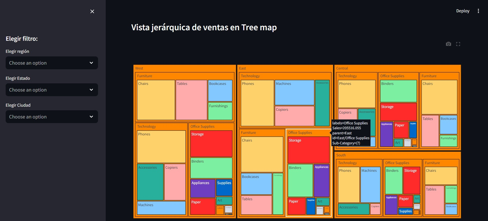
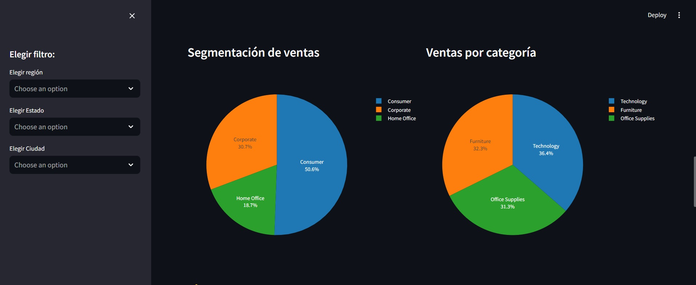
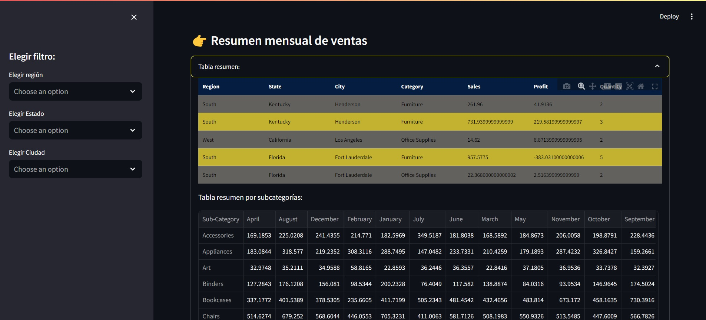
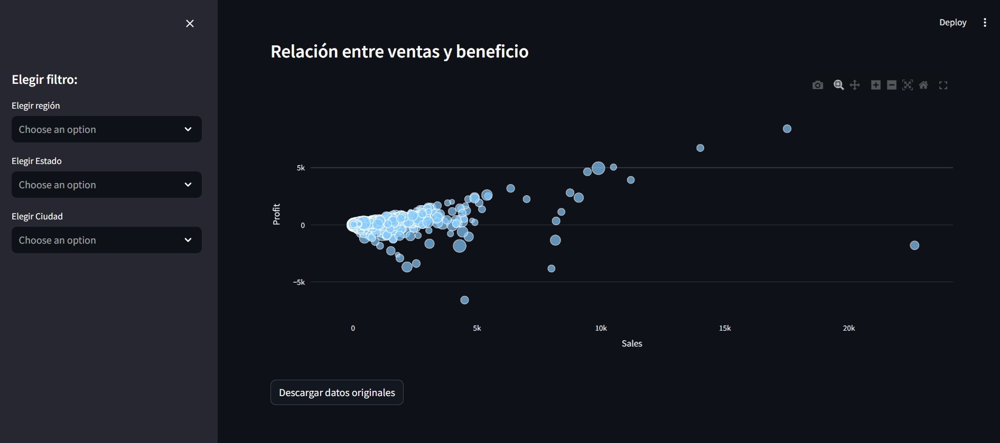

# SuperStore EDA

Análisis Exploratorio de Datos (EDA) usando Streamlit.

## Estructura del Proyecto

```plaintext
sales_streamlit/
│
├── resources/
│   └── SampleSuperStore.xls
│   └── img1.jpg
│   └── img2.jpg
│   └── img3.jpg
│   └── img4.jpg
│   └── img5.jpg
│   └── img6.jpg
└── src/
    ├── __init__.py
    ├── data_loader.py
    ├── filters.py
    ├── visualizations.py
    └── main.py
└── README.md
└── License.txt
```

+ resources/: Contiene los archivos de datos y las capturas de pantalla.
+ src/: Contiene el código fuente del proyecto.
    -  __init__.py: Archivo que marca el directorio como un paquete.
    -  data_loader.py: Carga y prepara los datos.
    - filters.py: Aplica los filtros a los datos.
    - visualizations.py: Genera visualizaciones a partir de los datos.
    - main.py: Archivo principal para ejecutar la aplicación Streamlit.

## Requisitos del Sistema
+ Python 3.8 o superior
+ Librerías especificadas en requirements.txt

## Instalación

+ Clona el repositorio.
    ```plaintext
     git clone https://github.com/miguelrdgzb/sales_streamlit.git

+ Navega al directorio del proyecto
    ```plaintext
    cd sales_streamlit

+ Crea un entorno virtual
    ```plaintext
        python -m venv env 
        env\Scripts\activate

+ Instala las dependencias
    ```plaintext
    pip install -r requirements.txt


## Ejecución de la aplicación

+ Desde el directorio raíz del proyecto ejecuta:
    ```plaintext
    streamlit run src/main.py


## Muestra








## Autor

>> Miguel Rodríguez

## Licencia

Este proyecto está licenciado bajo la Licencia MIT. Ver el archivo [LICENSE](License.txt) para más detalles.


